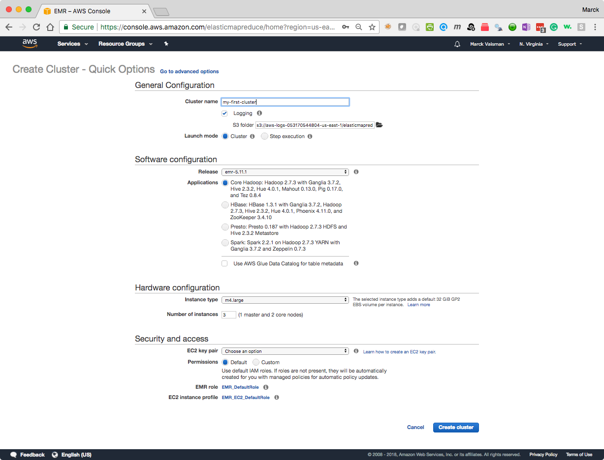

# ANLY502 - Massive Data Fundamentals<br>Lab: Hadoop, HDFS, Amazon Elastic MapReduce<br>February 5, 2018

## Start an Amazon EMR Cluster

1. Start an Amazon Elastic MapReduce (EMR) Cluster using Quickstart with the follwing setup (as shown in the picture):
	*  Give the cluster a name that is meaningful to you
	*  Use Release `emr-5.1.1`
	*  Select the first option under Applications
	*  Select 1 master and 2 core nodes, using `m3.xlarge` instance types
	*  Select your correct EC2 keypair or you will not be able to connect to the cluster
	*  Click **Create Cluster**

	<br>
	As soon as you create the cluster, you will see the cluster in "Starting" mode:
	
		

2. **You only need to do this once:** Once the cluster is in "Waiting" mode, click on the **Security Groups for Master** which will take you to the Security Group configuration page, and add port 22 like you did in the homework Tutorial (Follow next three screenshots)

	<br>
	<br>
	<br>
	
	
## SSH Into the Cluster

```
ssh hadoop@[[master-node-dns-name]]
```
Note the usernanme is **`hadoop`**. Get your cluster's master node IP address from the Cluster console.

You will see something like this:

```
morocoto ➜  ~  ssh hadoop@ec2-34-230-63-109.compute-1.amazonaws.com
Last login: Mon Feb  5 22:35:02 2018

       __|  __|_  )
       _|  (     /   Amazon Linux AMI
      ___|\___|___|

https://aws.amazon.com/amazon-linux-ami/2017.09-release-notes/
8 package(s) needed for security, out of 9 available
Run "sudo yum update" to apply all updates.

EEEEEEEEEEEEEEEEEEEE MMMMMMMM           MMMMMMMM RRRRRRRRRRRRRRR
E::::::::::::::::::E M:::::::M         M:::::::M R::::::::::::::R
EE:::::EEEEEEEEE:::E M::::::::M       M::::::::M R:::::RRRRRR:::::R
  E::::E       EEEEE M:::::::::M     M:::::::::M RR::::R      R::::R
  E::::E             M::::::M:::M   M:::M::::::M   R:::R      R::::R
  E:::::EEEEEEEEEE   M:::::M M:::M M:::M M:::::M   R:::RRRRRR:::::R
  E::::::::::::::E   M:::::M  M:::M:::M  M:::::M   R:::::::::::RR
  E:::::EEEEEEEEEE   M:::::M   M:::::M   M:::::M   R:::RRRRRR::::R
  E::::E             M:::::M    M:::M    M:::::M   R:::R      R::::R
  E::::E       EEEEE M:::::M     MMM     M:::::M   R:::R      R::::R
EE:::::EEEEEEEE::::E M:::::M             M:::::M   R:::R      R::::R
E::::::::::::::::::E M:::::M             M:::::M RR::::R      R::::R
EEEEEEEEEEEEEEEEEEEE MMMMMMM             MMMMMMM RRRRRRR      RRRRRR

[hadoop@ip-172-31-25-210 ~]$
```


## Run some HDFS commands

The reference guide for all the HDFS Shell commands is here: [https://hadoop.apache.org/docs/r2.7.3/hadoop-project-dist/hadoop-common/FileSystemShell.html](https://hadoop.apache.org/docs/r2.7.3/hadoop-project-dist/hadoop-common/FileSystemShell.html)

1. List files in cluster's HDFS (will be empty):
	`hdfs dfs -ls` or `hadoop fs -ls`
	
2. 	List files in a public S3 bucket owned by Prof. Vaisman, created for this course: `hdfs dfs -ls s3://bigdatateaching/`

	```
	[hadoop@ip-172-31-25-210 ~]$ hadoop fs -ls s3://bigdatateaching/
Found 11 items
drwxrwxrwx   - hadoop hadoop          0 1970-01-01 00:00 s3://bigdatateaching/criteo
drwxrwxrwx   - hadoop hadoop          0 1970-01-01 00:00 s3://bigdatateaching/forensicswiki
drwxrwxrwx   - hadoop hadoop          0 1970-01-01 00:00 s3://bigdatateaching/graphx
drwxrwxrwx   - hadoop hadoop          0 1970-01-01 00:00 s3://bigdatateaching/ham
drwxrwxrwx   - hadoop hadoop          0 1970-01-01 00:00 s3://bigdatateaching/internet-census-2012
drwxrwxrwx   - hadoop hadoop          0 1970-01-01 00:00 s3://bigdatateaching/meta
drwxrwxrwx   - hadoop hadoop          0 1970-01-01 00:00 s3://bigdatateaching/ncdc
drwxrwxrwx   - hadoop hadoop          0 1970-01-01 00:00 s3://bigdatateaching/nyctaxi
drwxrwxrwx   - hadoop hadoop          0 1970-01-01 00:00 s3://bigdatateaching/quazyilx
drwxrwxrwx   - hadoop hadoop          0 1970-01-01 00:00 s3://bigdatateaching/shakespeare
drwxrwxrwx   - hadoop hadoop          0 1970-01-01 00:00 s3://bigdatateaching/spam
[hadoop@ip-172-31-25-210 ~]$
	```
	
3. Copy a file from the course's S3 public bucket **to your personal S3 bucket**
`hadoop fs -cp s3://bigdatateaching/shakespeare/100-0.txt s3://[[your-bucket-name]]/`
**Note: this file exists until you delete it**

4. Copy a file from the course's S3 public bucket **the cluster's HDFS**
```
hadoop fs -cp s3://bigdatateaching/shakespeare/100-0.txt ./
hadoop fs -ls
```


